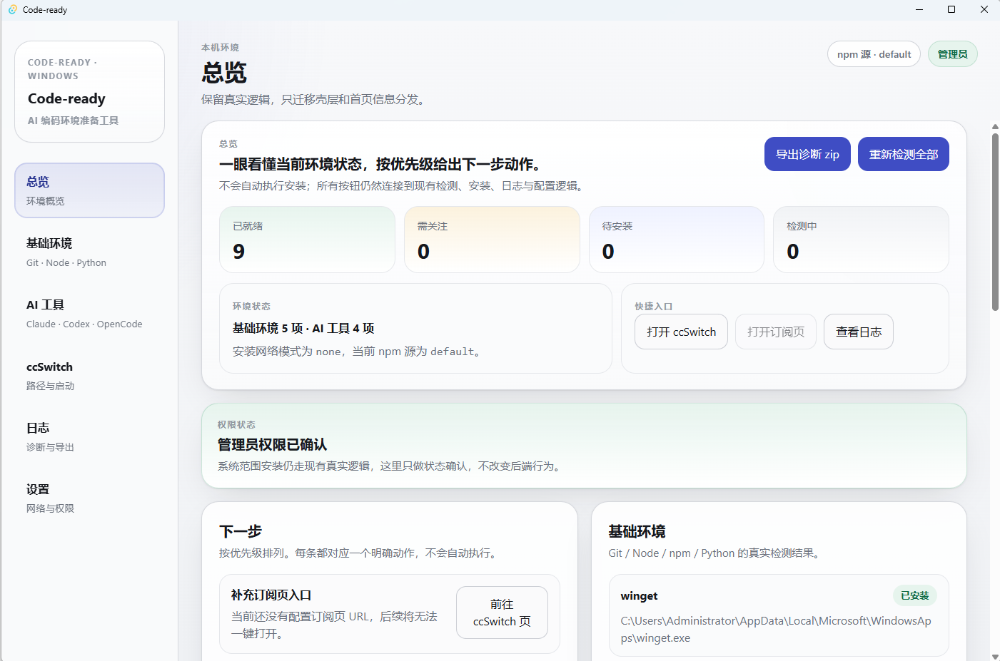

# Code-ready

> 面向 Windows 的 AI 编码环境准备工具 — 检测、安装和管理 Claude Code、Codex CLI、OpenCode、ccSwitch 等开发工具。



## 项目简介

配置 AI Coding 工具链对新手来说并不简单：CLI 工具的安装路径、版本状态、PATH 配置、ccSwitch 路径等信息分散且不透明，出问题后排查也很困难。

**Code-ready** 用桌面应用的方式，将环境检测、安装状态、修复提示和日志导出整合到一个界面中，帮助你快速了解和准备 AI 编码环境。

## 核心功能

- **环境检测 Dashboard** — 一览所有工具的安装和运行状态
- **基础环境检测** — Node.js、Git 等基础工具的版本和路径检查
- **AI CLI 工具检测** — Claude Code、Codex CLI、OpenCode 等工具的状态展示
- **ccSwitch 路径配置与检测** — 支持非默认路径、浏览选择 exe、版本检测
- **PATH 缺失提示** — 检测工具是否已安装但未加入 PATH
- **安装失败 / 检测失败状态提示** — 清晰标注各类异常状态
- **非管理员权限提示** — 检测并提醒需要管理员权限的操作
- **日志预览** — 在应用内直接查看日志内容
- **打开日志目录** — 快速定位日志文件
- **导出诊断 zip** — 一键打包诊断信息用于排查问题
- **Windows 安装包分发** — 提供 NSIS 安装包和 MSI 安装包

## 下载安装

前往右侧 [Releases](../../releases) 页面下载最新版本：

| 文件 | 说明 |
|------|------|
| `Code-ready_0.1.0_x64-setup.exe` | 推荐下载，NSIS 安装包 |
| `Code-ready_0.1.0_x64_en-US.msi` | 备选下载，MSI 安装包 |

> 当前版本为 v0.1.0，仅支持 Windows x64。

## 使用说明

1. 下载并安装 Code-ready
2. 启动应用，查看 **Dashboard** 总览
3. 进入 **基础环境** 页检查 Node.js / Git 等基础工具
4. 进入 **AI 工具** 页检查 Claude Code / Codex CLI / OpenCode
5. 进入 **ccSwitch** 页配置路径
6. 如检测失败，进入 **日志** 页查看日志或导出诊断 zip

## ccSwitch 非默认路径说明

- 如果 ccSwitch 不在默认路径，可以在 ccSwitch 页面点击 **"浏览..."** 选择 exe 文件
- 保存后重新检测即可
- 如果版本无法读取但 exe 存在，会显示 **"版本未提供"**，这不代表未安装

## 开发者运行

### 环境要求

- Node.js LTS
- Rust 工具链（通过 rustup 安装）
- Visual Studio Build Tools（提供 MSVC 链接器和 Windows SDK）
- WebView2 Runtime（Windows 10 21H2+ 和 Windows 11 已预装）

### 开发命令

```powershell
npm install                # 安装依赖
npm run tauri dev          # 启动开发窗口
npm run build              # 前端构建
npm run tauri build        # 打包 Windows 安装包
```

### 测试命令

```powershell
npx vitest run src/App.test.tsx --reporter=verbose
```

### 构建产物

打包完成后，安装包位于：

```
src-tauri/target/release/bundle/nsis/Code-ready_0.1.0_x64-setup.exe
src-tauri/target/release/bundle/msi/Code-ready_0.1.0_x64_en-US.msi
```

> **注意**：当前为未签名构建，请自行评估安全风险。

## 技术栈

- [Tauri](https://tauri.app/) v2 — 桌面应用框架
- [React](https://react.dev/) 19 — 前端 UI
- [TypeScript](https://www.typescriptlang.org/) 5 — 类型安全
- [Rust](https://www.rust-lang.org/) — 后端逻辑与系统交互
- [Vite](https://vite.dev/) 7 — 前端构建工具
- [Vitest](https://vitest.dev/) — 前端测试框架

## 项目状态

当前版本为 **v0.1.0**，属于早期可体验版本，主要面向 Windows 平台。

## Roadmap

- 更完善的安装修复能力
- 更详细的工具版本识别
- 更好的 ccSwitch 配置管理
- 更多 AI Coding 工具支持
- 自动诊断报告
- 更完整的错误修复向导

## 免责声明

Code-ready 是环境检测和辅助安装工具，不隶属于 Claude Code、Codex、OpenCode 或 ccSwitch 官方项目。相关工具名称归其各自项目所有。
